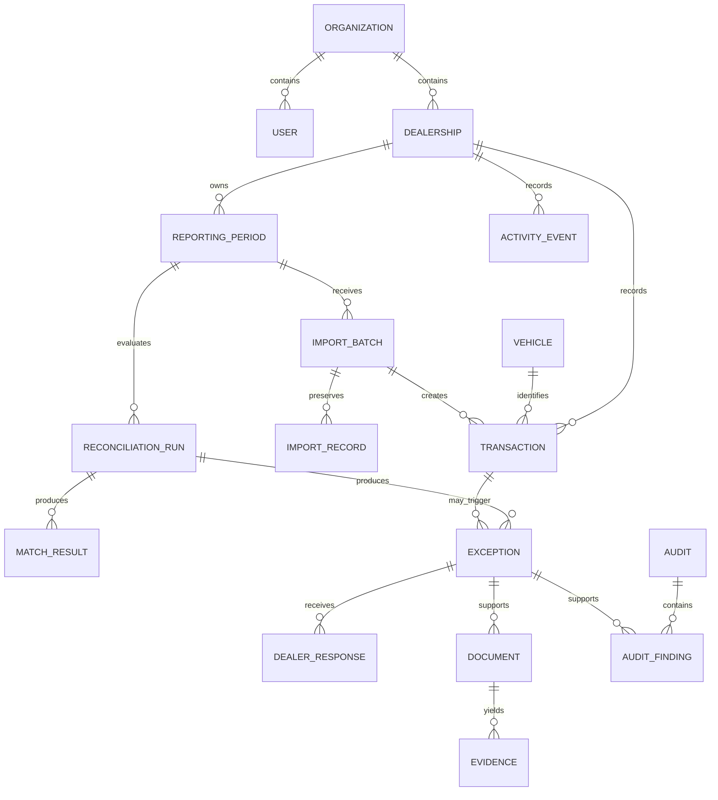

# DealerSync product requirements

Status: local-pilot product requirements, updated 2026-08-10.

## 1. Product purpose

DealerSync is an operational compliance workspace for Ontario motor-vehicle dealerships and regulatory reviewers. It reconciles dealership transaction records with registration-style records, explains discrepancies, preserves source provenance, collects dealer responses and evidence, and supports reviewer decisions without presenting automated flags as regulatory findings.

## 2. User types and goals

### Dealership compliance user

- Understand reporting readiness and the work requiring attention.
- Import, validate, inspect, and correct dealership records without overwriting source truth.
- Investigate a VIN, transaction, or exception in context.
- Explain a discrepancy, attach evidence, and follow its review state.
- Export the dealership's current reconciliation state.

### Regulatory reviewer

- Prioritize dealerships and exceptions across the accessible review portfolio.
- Reconstruct a VIN's available transaction, registration, evidence, and decision history.
- Review dealer responses, request evidence, resolve exceptions, and preserve the reason for every decision.
- Create scoped audits and evidence-backed findings.
- Export defensible review outputs.

### System administrator

- Manage organizations, dealerships, users, rules, and fee schedules.
- Inspect configuration and system activity without bypassing organization boundaries.

## 3. Product principles

1. A flag is a system-derived discrepancy, not a human finding.
2. Original source values remain immutable; normalization, corrections, and decisions are separate layers.
3. Important entities are navigable. Users should not copy identifiers between pages.
4. Investigation uses progressive disclosure: inline context, a URL-addressable quick-view drawer, then a full workflow page where necessary.
5. Server state owns business records; URL state owns shareable search, filters, pagination, tabs, and open entity drawers.
6. Every mutation produces visible feedback and an activity event.

## 4. Functional requirements

### Authentication and workspace boundaries

- The system shall authenticate users with a secure session cookie.
- The system shall route users to a dealer, reviewer, or administrator workspace based on role.
- Dealer roles shall only read or mutate records for their assigned dealership.
- Reviewer roles shall only access dealerships made available to their review organization.
- Every entity-detail endpoint shall repeat authorization checks; client-side hiding is insufficient.

### Entity navigation

- Dealerships, VINs, transactions, exceptions, audits, documents, import batches, reporting periods, and reconciliation runs shall expose a consistent interactive affordance.
- A quick view shall be addressable with URL query parameters and shall close without losing table filters or pagination.
- Browser back and forward shall restore drawer state.
- Entity quick views shall expose related objects as links.

### Transactions and VIN context

- The register shall support server-side pagination, VIN/search filtering, reconciliation-state filtering, and predictable empty states.
- Transaction detail shall show vehicle identity, reporting period, transaction fields, fee fields, source/import provenance, registration comparison, match result, exceptions, documents/evidence, and activity.
- Original, normalized, corrected, system-derived, and human-decided values shall be visually distinguished.
- Corrections shall record field, original value, new value, actor, timestamp, and reason.

### Exceptions

- Exception lists shall support status, priority, dealership, rule, impact, and search filtering as appropriate to the role.
- Exception detail shall explain the rule, triggering values, fee impact, related records, evidence, dealer response, assignment, due date, and activity.
- Dealer users shall be able to submit a categorized explanation and evidence.
- Reviewers shall be able to request evidence, transition an exception, and resolve only with a resolution type and reason.
- Destructive or final decisions shall require explicit confirmation.

### Imports

- Users shall be able to select a source type, upload a CSV, map columns, validate before commit, and inspect row-level errors and warnings.
- Batch detail shall show counts, source, uploader, reporting period, mapping, rejected rows, resulting transactions, and related reconciliation run.
- Error messages shall identify the problematic column or row and a recovery action.

### Documents and evidence

- Uploads shall validate size, MIME type, extension, authorization, and target relationships.
- Document detail shall show uploader, timestamp, validation/extraction state, storage provenance, and related dealership, transaction, exception, and evidence.
- Document download shall re-check dealership authorization.

### Reconciliation

- Runs shall be immutable and store ruleset version, inputs, counts, timestamps, initiator, match results, and exceptions.
- Run detail shall show status, duration, counts, rule breakdown, and simple deltas from the previous run.
- Re-running after a correction or evidence change shall create a new run rather than mutate prior results.

### Audits and findings

- Reviewers shall create a scoped audit with dealership, reporting period, reviewer, due date, and scope.
- Audit detail shall expose overview, reconciliation, exceptions, evidence, findings, and activity.
- Workflow progress shall derive from bounded compliance checkpoints, not arbitrary checklist items.
- A finding shall require an audit, linked exception, classification, description/conclusion, status, and supporting evidence or an explicit statement that evidence is insufficient.
- Finding status changes and resolution shall create activity events.

### Dashboards, search, and reports

- Dashboard metrics representing work shall link to the corresponding filtered queue.
- Reviewer global search shall support VIN, dealership/trade name, registration number, exception ID, audit ID, and transaction ID.
- Dealer search shall be restricted to the dealer boundary.
- Search results shall be grouped by entity type and support keyboard navigation.
- Dealer reports shall include transaction register, open exceptions, readiness, and evidence requirements.
- Reviewer reports shall include dealership reconciliation, exceptions, fee variance, findings, and activity.
- Every export shall record filters, scope, and generated timestamp.

## 5. Entity relationships

## 6. Main workflows

### Dealer response

Dashboard metric or queue -> exception quick view -> transaction comparison -> explanation and evidence -> submit -> response-received state -> reviewer action -> visible outcome.

### Reviewer investigation

Portfolio priority -> dealership quick view -> VIN/transaction -> rule and comparison -> dealer response/evidence -> decision -> activity entry -> finding when audit-scoped.

### Import and reconciliation

Select source -> map columns -> validate preview -> correct mapping/errors -> commit immutable raw rows and canonical records -> create reconciliation run -> inspect counts and exceptions -> navigate to affected records.

### Audit

Create scope -> confirm inputs -> inspect reconciliation -> review exceptions/responses/evidence -> create supported findings -> conclude -> generate findings report -> close audit.

## 7. Permissions

The permission matrix in `src/domain/auth/permissions.ts` is authoritative. Route guards, services, downloads, and entity-detail APIs shall all enforce it. A dealer may respond but not resolve; a reviewer may resolve and manage audits but may not mutate dealer source records; a system administrator may configure rules and users. Organization access for reviewers must be explicit before production.

## 8. System, validation, and error behavior

- Business transitions shall be validated in the domain layer and repeated by services.
- IDs supplied in URLs shall be treated as untrusted input.
- Conflicting updates shall fail safely instead of silently replacing newer state.
- Forms shall keep valid user input after recoverable errors and associate errors with fields.
- Loading states shall match final component dimensions; filtered-empty, true-empty, forbidden, and failed states shall be distinct.
- Buttons shall indicate pending state and prevent duplicate submissions.
- Errors shall state what failed, why when known, and the next recovery action.

## 9. Auditability and provenance

- Material activity shall record organization, dealership, actor, entity type/ID, action, metadata, and timestamp.
- Human-readable activity shall resolve actor and entity names while retaining underlying IDs.
- Decision views shall expose source file/batch, raw value, normalized value, corrections, run/ruleset, and human decision as separate layers.
- Automated events may be grouped for readability but must remain queryable individually.

## 10. Accessibility and responsive requirements

- All core workflows shall be keyboard operable with visible focus and logical order.
- Drawers/dialogs shall trap focus, close with Escape, and return focus to the trigger.
- Icon buttons shall have accessible names; tables and forms shall use native semantics.
- Status meaning shall not depend on color alone.
- Mobile touch targets shall be at least 44px and form text shall avoid browser zoom.
- Reduced-motion preferences shall be respected.
- Desktop tables may scroll horizontally on narrow screens, but the primary identity and row action must remain understandable.

## 11. Performance expectations

- Transactions, exceptions, dealerships, documents, and activity shall use server-side pagination once datasets exceed one page.
- Default product pages shall render no more than 50 dense rows; page size shall be bounded.
- Search/filter state shall be URL-backed and database queries shall use indexed columns.
- Drawers shall fetch a single authorized entity payload and shall not duplicate the full table dataset in client state.

## 12. Current limitations

- Local SQLite and local files are pilot infrastructure, not multi-user production storage.
- Reviewer organization-to-dealership assignment is not yet modeled; current seeded reviewer access is portfolio-wide.
- Production identity, malware scanning, retention, backups, observability, rate limiting, and concurrency controls remain outstanding.
- No live OMVIC, MTO, DMS, accounting, email, or object-storage integration exists.
- Regulatory rules, terminology, permissions, fee schedules, and outputs require validation by authorized Ontario stakeholders.
- Automated reconciliation is not a compliance certification or final determination.

## 13. Future integration boundaries

- Identity provider behind the session/auth service.
- PostgreSQL behind the Drizzle repository boundary.
- Object storage and scanning behind the document storage interface.
- Registration, DMS, and accounting connectors feeding immutable import batches.
- Notifications behind domain events; no workflow shall depend on email delivery.
- Versioned rule configuration and fee schedules administered through a controlled system workspace.
